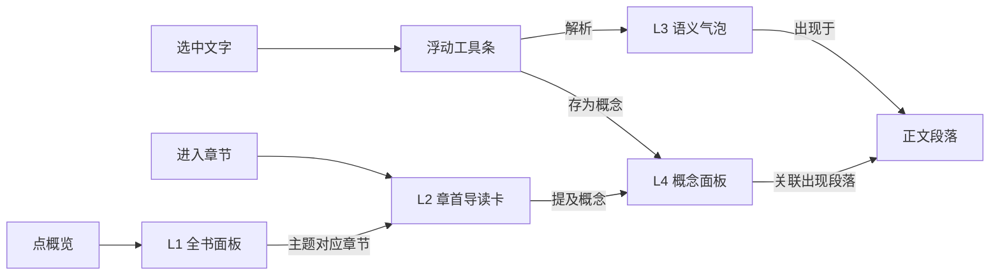

# 四层级交互逻辑设计

> 项目：ECUST_Reader3
> 日期：2026-08-05
> 状态：设计定稿，待评审后实施
> 前置：存储设计见 `docs/four-level-data-storage.md`；AI 调用采用 **openai 官方包**（不手搓）

---

## 一、总体框架

四层按"何时花钱"分成两组，交互也据此设计：

```
┌─ 预生成组（懒生成，首次进入才生成）──────────┐
│ L1 全书层   key=book_id      展示：全书概览面板  │
│ L2 章节层   key=chapter_id   展示：章首导读卡片   │
└──────────────────────────────────────────────┘
┌─ 实时组（读者选中才触发，随用随生成）──────────┐
│ L3 语义层   key=MD5(选中文本)  展示：语义气泡卡   │
│ L4 概念层   key=规范化词条名   展示：概念面板     │
└──────────────────────────────────────────────┘
```

**核心原则**
- 预生成组：**首次进入懒生成**（不导入即烧钱），生成结果持久化，之后秒开
- 实时组：**选中 → 手动确认 → 流式生成 → 缓存**，缓存带模型版本，可一键清空，收藏的保留
- 展示统一：**SSE 流式逐字** + 完成后可编辑；所有层级共用一套"分析卡片"组件

---

## 二、UI 组件设计

### 1. 浮动选中工具条（L3/L4 共用入口）
- 触发：在正文中**选中一段文字**后，选中区域上方出现小工具条
- 按钮：`解析`（L3 语义）、`存为概念`（L4 概念）
- 消失：点击别处 / 按 Esc / 清空选区

### 2. 章首导读卡片（L2）
- 位置：每章正文开头、章标题下方
- 内容：本节要点 / 论证步骤 / 关键转折（折叠态默认收起，展开可看）
- 状态：未生成 → 显示"本章导读未生成，点击生成"；生成中 → 流式打字；已生成 → 显示 + 可编辑
- 生成：点击按钮或进入章节时自动检查（懒生成）

### 3. 全书概览面板（L1）
- 入口：阅读器顶栏"概览"按钮（书库页也可放）
- 内容：核心问题 / 主题框架 / 论证逻辑
- 形态：弹层或侧栏面板，复用"分析卡片"

### 4. 语义气泡卡（L3）
- 触发：工具条点"解析"后，在选中文字下方弹出气泡
- 内容：要点 / 释义 / 句间关系
- 可收起、可收藏；气泡内显示"来源：本书正文段落"

### 5. 概念面板（L4）
- 入口：侧栏"概念"页签（与目录页签并列）
- 内容：本书已收录概念列表（词条名 + 定义摘要），点击展开完整定义
- 收藏项置顶显示

---

## 三、逐层调用与数据流

### L1 全书层
```
进入书页/点"概览"
  → GET /api/layer/book/{book_id}
  → 命中？显示卡片
  → 未命中？POST /api/layer/book/{book_id}/generate（SSE 流式写入 book_layer）
```
- 生成中断/失败：落库已流出的部分，按钮变为"继续生成"

### L2 章节层
```
进入第 N 章
  → GET /api/layer/chapter/{book_id}/{chapter_idx}（chapter_idx=spine_order）
  → 命中？章首显示导读卡（可展开）
  → 未命中？章首显示"生成"按钮（不自动烧钱，点击才生成；SSE 流式写入 chapter_layer）
```

### L3 语义层
```
选中文字 → 工具条"解析"
  → POST /api/layer/semantic { book_id, text }
  → 后端：规范化（空白/全半角/Unicode）→ MD5
  → 查 semantic 缓存(book_id, hash)？
      命中 → 直接返回
      未命中 → 流式调 AI → 写入 → 返回
  → 前端：选中文字下方弹气泡卡，流式显示
```
- key=MD5 的细节：**跨段落、局部选择均可用**（键由选中文本本身决定）

### L4 概念层
```
选中词条 → 工具条"存为概念"
  → POST /api/layer/concept { book_id, term }
  → 规范化词条名 → 查缓存 → 未命中流式生成 → 写入
  → 前端：概念面板新增条目（去重），词条定义摘要
  → 同时记录 occurrences：该词条出现在哪些段落（便于回跳定位）
```

---

## 四、层间对接



- **概念 ↔ 段落**：`concept_occurrences(concept_id, paragraph_id)`，概念定义里可列出"出现于第几章第几节"，点击回跳
- **语义 ↔ 概念**：语义气泡内容若涉及概念面板已有词条，可点击跳转到概念定义
- **L2 ↔ L1**：全书面板的主题框架可链接到对应章节的导读卡

---

## 五、后端 API 契约（provider 无关）

统一前缀 `/api/layer`，内部经 openai 官方包调用，SSE 协议：
- `data: {"delta": "..."}` 增量
- `data: {"done": true}` 完成（合法 JSON）
- `data: {"error": "..."}` 出错

| 方法 | 路径 | 用途 |
|---|---|---|
| GET | `/api/layer/book/{book_id}` | 读 L1 |
| POST | `/api/layer/book/{book_id}/generate` | 懒生成 L1（SSE） |
| GET | `/api/layer/chapter/{book_id}/{chapter_idx}` | 读 L2（chapter_idx=spine_order） |
| POST | `/api/layer/chapter/{book_id}/{chapter_idx}/generate` | 懒生成 L2（SSE） |
| POST | `/api/layer/semantic` | L3：body {book_id, text}，查缓存/生成（SSE） |
| POST | `/api/layer/concept` | L4：body {book_id, term}，查缓存/生成 |
| GET | `/api/layer/concepts/{book_id}` | L4 列表 |
| POST | `/api/layer/{kind}/{key}/star` | 收藏（L3 按 hash，L4 按 term） |
| GET | `/api/layer/stats/{book_id}` | 四层生成状态总览（哪些已生成） |

---

## 六、缓存与持久化策略

- **缓存**：L3/L4 查 `(book_id, hash|term)` 命中即返回，未命中才调 AI
- **model_version**：每条缓存带模型版本，模型升级后一键清空全部缓存（保留收藏）
- **时间清理**：定期删除超过 N 天的非收藏缓存
- **收藏**：`saved_annotations` 表，收藏项清理时保留，可导出
- **落库**：预生成组写入后长期保留，不参与清理

---

## 七、生成时机与成本控制

| 层 | 时机 | 成本 |
|---|---|---|
| L1 | 点"概览"且未生成时 | 1 次/书 |
| L2 | 进章后点"生成"按钮 | 1 次/章（可"全部生成"批量） |
| L3 | 选中点"解析" | 1 次/选中文本（缓存命中则 0） |
| L4 | 选中点"存为概念" | 1 次/词条（缓存命中则 0） |

> 语义层不做全量预生成（按段生成成本高），只按需。

---

## 八、错误与中断处理

- 流式中途断网/报错：已流出内容落库，显示"生成中断，继续生成"
- 超时：设置合理的请求超时，超时按中断处理
- 重复触发：同一 key 正在生成时，再次触发显示"正在生成"而非重复调用
- 空结果：模型返回空/无效，提示重试
